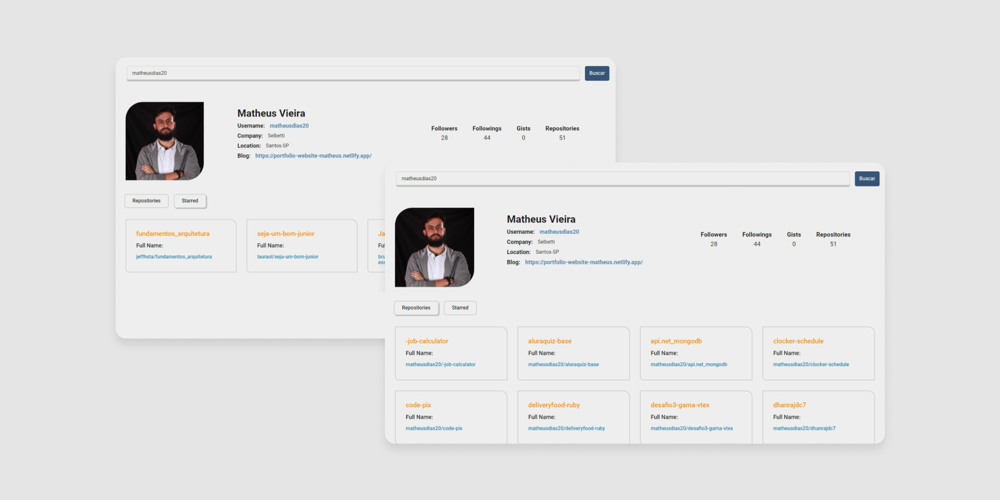

<h1 align="center">🔍 Github Profile Search</h1>

  <strong>Aplicação que mostra os repositórios e informações dos usuários do github</strong>

  

### Site 💻

- [Github Profile Search](https://github-profile-search-matheusdias20.vercel.app/)

## Libraries: 🚀
- React

- Axios
- React-Tabs
- Styled-Components

## API's: 📊

- [API Github](https://docs.github.com/pt/rest/reference/users)

